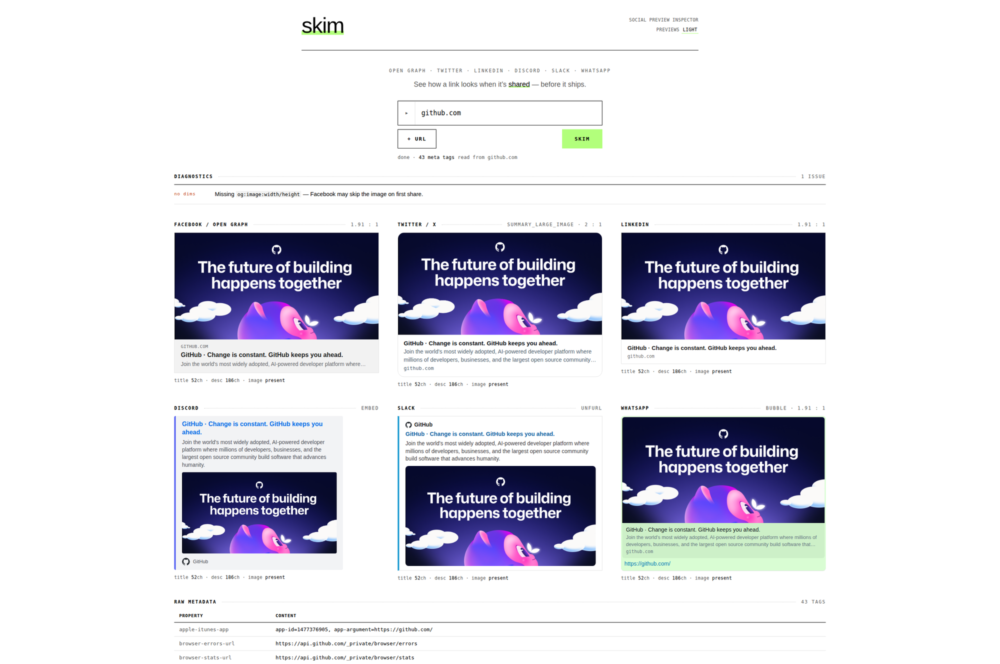

# skim

Preview how a link looks when shared on social media — **including `localhost`** — without deploying.

skim extracts OpenGraph / Twitter / standard meta tags from any URL — one or several at once — and renders realistic preview cards for **Facebook, Twitter/X, LinkedIn, Discord, Slack, and WhatsApp**, plus validation diagnostics and a raw meta-tag grid.



> The cards are **approximations** of how each platform renders a shared link — not pixel-perfect reproductions. Exact appearance varies by platform, client, and device, and shifts over time as the platforms change. Use skim to sanity-check your tags and layout, not to match a specific platform down to the pixel.

## Install

With Go installed (1.26+):

```bash
go install github.com/Seismix/skim@latest
```

The UI ships prebuilt and embedded, so there's no Node toolchain to install. This drops a `skim` binary in your `$GOBIN` (usually `~/go/bin`, or `%USERPROFILE%\go\bin` on Windows) — make sure that's on your `PATH`.

## Quick start

Run it:

```bash
skim
```

It starts a local server on a free port and opens your default browser. To pre-fill and auto-preview a URL:

```bash
skim http://localhost:3000
```

(Building from source instead? The binary lands at `./dist/skim` — see [Building](#building).)

You can type a bare host — `reddit.com` becomes `https://reddit.com`, while `localhost:3000` (and `127.0.0.1`, `*.localhost`) becomes `http://…`.

Comparing several links? Add more inputs with the **+** button (or paste a comma-separated list into a single box), then skim renders a stacked card set per URL. Each is fetched independently and concurrently, so one bad link won't sink the rest, and the address bar keeps a `?url=` per link so the comparison stays shareable.

Flags: `--port N` (fixed port), `--no-open` (don't launch the browser), `--user-agent "…"`, `-v` (print the version and exit). skim binds loopback (`127.0.0.1`) only — it's a personal local tool. Press Ctrl+C to stop — the listener closes and the port frees.

By default skim sends the OpenGraph crawler User-Agent (`facebookexternalhit`), since many sites serve share metadata **only** to recognized crawlers — Reddit, for example, returns an anti-bot page otherwise. This makes skim see what Facebook / WhatsApp / Discord / Slack see. Override with `--user-agent`.

## Why a local server at all?

The localhost feature dictates the architecture. A browser page can't `fetch()` an arbitrary origin's raw HTML (CORS + mixed content), so skim does the fetch **on your machine** and hands the parsed result to the UI. That fetch resolving to *your* `localhost` is why skim runs locally instead of as a hosted site.

```text
skim binary
├── GET  /             → serves the embedded Svelte UI (web/dist)
├── POST /api/fetch-og → fetches one URL (or a batch of them) on THIS machine, parses meta, returns JSON
└── GET  /api/img      → proxies a preview image same-origin, so browser tracking
                          protection / hotlink checks don't block it
```

## Scripting (JSON)

`/api/fetch-og` is a plain JSON endpoint, handy for scripts and agents. Post a single `url`:

```bash
curl -s localhost:PORT/api/fetch-og -d '{"url":"example.com"}'
# → { "title": "...", "description": "...", "image": "...", "allMeta": { ... } }
```

…or a `urls` array to fetch a batch concurrently. The response is one entry per input URL, each with its own `data` or `error`, in order:

```bash
curl -s localhost:PORT/api/fetch-og -d '{"urls":["example.com","localhost:3000"]}'
# → { "results": [ { "url": "...", "data": { ... } }, { "url": "...", "error": "..." } ] }
```

Grab `PORT` from the startup banner, or pin it with `--port`.

## Building

Building needs **Go** and **pnpm** (used only to build the UI; the shipped binary has no runtime deps).

```bash
make           # build the Svelte UI, then the native binary → dist/skim
make dist      # build the UI, then cross-compile static binaries for win/mac/linux → dist/
make web       # build just the Svelte UI → web/dist
make run ARGS="http://localhost:3000"   # build, then run the binary serving the built UI
```

The Svelte UI is compiled by Vite to static assets and embedded into the binary via `go:embed`, so distribution is still a single file. Cross-compilation needs no extra setup — Go's `GOOS`/`GOARCH` plus `CGO_ENABLED=0` produce fully static binaries.

## Developing the UI

For live frontend work with hot-reload:

```bash
make dev        # or: cd web && pnpm dev
```

This starts the Vite dev server (HMR for `web/src/**`) and **automatically builds and runs the Go backend**, proxying `/api` to it, so the UI is fully functional while you edit. Vite prints the local URL (e.g. `http://localhost:5173`); Ctrl+C stops both and frees the backend port. Only the UI hot-reloads — `main.go` changes need a dev-server restart.

## Tech stack

| Layer | Technology |
| ------ | ------ |
| Server + CLI | Go (`net/http`, `embed`) |
| HTML parsing | [goquery](https://github.com/PuerkitoBio/goquery) |
| UI | [Svelte 5](https://svelte.dev/) + [Vite](https://vite.dev/) + [Tailwind CSS](https://tailwindcss.com/), built to static assets and embedded; Milk Interactive branding |
